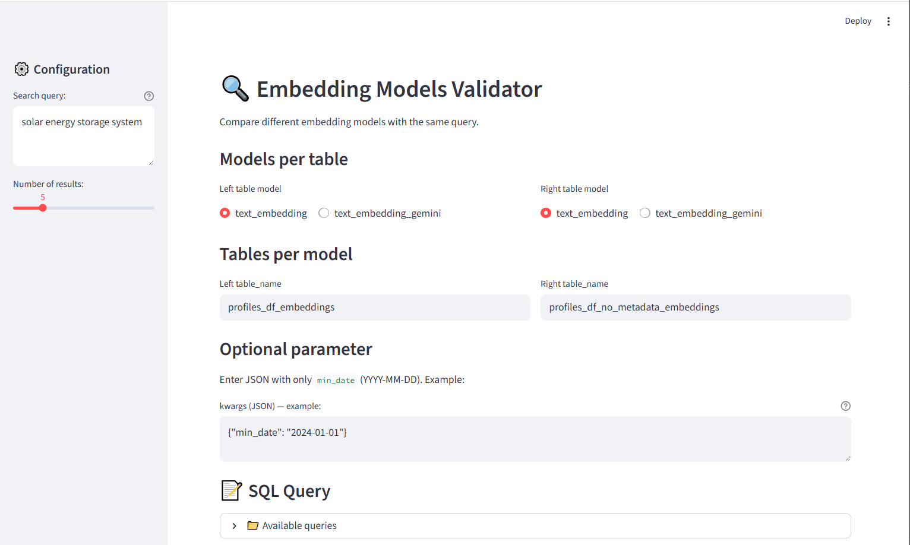
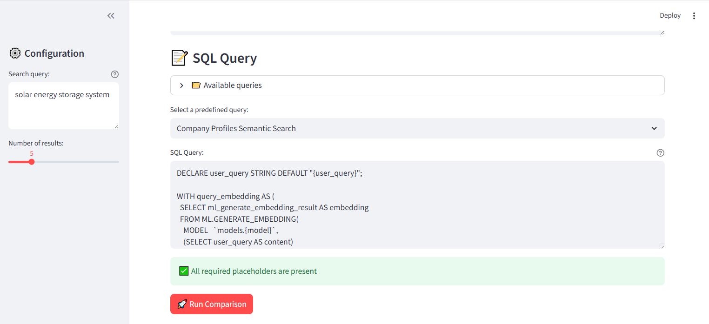
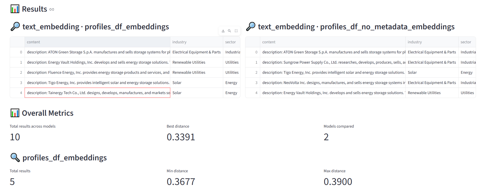
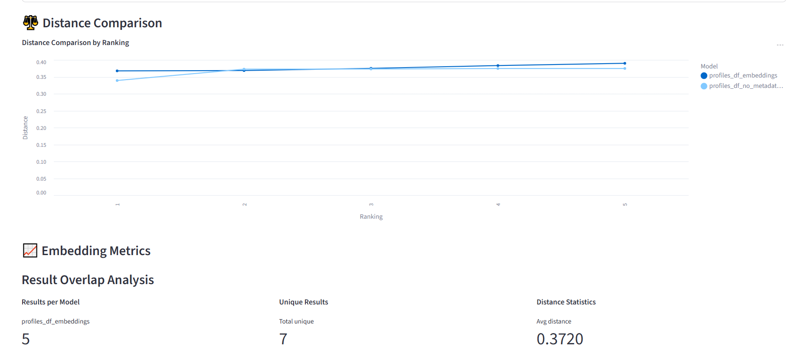

# Embeddings Module

Module for creating and managing text embeddings using Google Cloud's Vertex AI models.

## 🎯 Functionality

This module allows you to:
- **Create remote models** in Vertex AI using Google embeddings
- **Generate embeddings** from tables with text fields
- **Compare embedding models** using a Streamlit app
- **Deploy infrastructure** using Terraform

## 🏗️ Structure

```
embeddings/
├── src/                          # Main code
│   ├── embeddings.py             # SemanticSearch class
│   ├── scripts/                  # Utility scripts
│   │   ├── create_embeddings.py  # Create BigQuery embeddings tables
│   │   └── validator.py          # Streamlit app to compare models
│   └── utils/                    # Helper functions
├── terraform/                    # Infrastructure code
├── pyproject.toml                # Dependencies
└── README.md                     # This file
```

## 🚀 Step-by-Step Process

### Step 1: Create Remote Models with Terraform

Terraform creates remote models in Vertex AI that can be called from BigQuery, based on existing Vertex models:

- **text-embedding-005**: Standard embedding model
- **gemini-embedding-001**: Advanced Gemini embedding model

**Costs per 1000 characters:**
- **text-embedding-005**: $0.00002 (0.002 cents)
- **gemini-embedding-001**: $0.00012 (0.012 cents)

### Step 2: Create Embeddings Tables

Once the models are created, use the `create_embeddings.py` script to:

1. **Check character limits** before processing (default: 300M characters)
2. **Calculate costs**:
   - text-embedding-005: 300,000,000 × $0.00002/1000 = $6
   - gemini-embedding-001: 300,000,000 × $0.00012/1000 = $36
3. **Create new BigQuery table** with embeddings for the selected text field

### Step 3: Example Queries

The module includes example queries that work on embedding tables you've created. **Replace the table names** in these queries with your actual embedding tables.

### Step 4: Model Comparison with Streamlit

The `validator.py` script runs a simple Streamlit app that allows you to:

- **Select a query** (on an embedding table)
- **Input search terms** to see results
- **Select two models** to compare embeddings
- **Compare results** from both models side by side

**Note**: You must have created the embedding table with both models beforehand.

## 💰 Costs

Embedding model prices in Vertex AI:

- **text-embedding-005**: $0.00002 per 1000 characters
- **gemini-embedding-001**: $0.00012 per 1000 characters

For updated pricing, check the [official Google Cloud documentation](https://cloud.google.com/vertex-ai/generative-ai/pricing?hl=es-419).

## 📊 Benchmarking

To compare the performance of different embedding models, check the [MTEB leaderboard on Hugging Face](https://huggingface.co/spaces/mteb/leaderboard?utm_source=chatgpt.com).

## 🔧 Configuration

### Required environment variables

```bash
GOOGLE_APPLICATION_CREDENTIALS=path/to/credentials.json
GCP_PROJECT_ID=your-project-id
GCP_BIG_QUERY_DATABASE=your-database
```

### Deploy with Terraform

```bash
cd terraform
terraform init
terraform apply
```

### Create embeddings table

```bash
cd src/utils/ml/embeddings/src/scripts
python create_embeddings.py
```

### Run validation app

```bash
cd src/utils/ml/embeddings/src/scripts
python validator.py
```

## 📝 Notes

- Models are deployed in Vertex AI for scalability
- Embedding tables are created automatically in BigQuery
- The Streamlit app allows validation and result comparison
- Support for multiple Google embedding models
- Character limits and cost calculations are built-in

---

---

## Validator Frontend Walkthrough

The `validator.py` Streamlit app lets you compare two embedding model versions side by side. Each version is typically stored in its own table. You can:

- Compare results from two models with the same user query
- Parameterize the SQL with placeholders like `{user_query}`, `{model}`, `{table_name}`, `{limit_results}`, and optional `{min_date}`
- Inspect distances, overlap, and detailed content/metadata

### Steps


1. Select left and right models and their table names

   Write your text (search query) and set the number of results



2. Select a predefined query or write a query 



3. Run the comparison to view side-by-side tables with results and distance metrics




